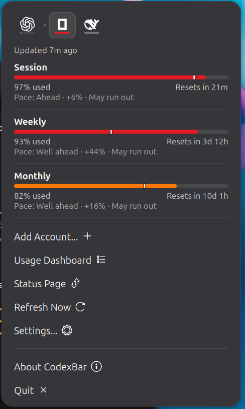

# CodexBar for GNOME

A GNOME Shell panel extension that shows AI provider usage limits, matching the
layout of the macOS CodexBar menu. It reads from the
[`codexbar`](https://github.com/steipete/CodexBar) command line tool, so nothing
is scraped and no browser cookies are handled here.

Targets GNOME Shell 50. Uses the default theme; `stylesheet.css` only sets
spacing and fill colours.

## Screenshots

The popup, with OpenCode Go selected. Each bar carries a tick at the point where
usage *should* be by now, so running hot is visible at a glance. A pace line
appears only when a window is actually over-consumed, which here is all three.



The tabs are provider logos, so the popup drops the big provider-name header. A
dot in the strip marks the provider the top-panel indicator is tracking. Balance
providers such as DeepSeek render their value instead of a misleading empty bar,
because a balance has no percentage to draw:


## Install

```sh
git clone https://github.com/lhw/codexbar-gnome
cd codexbar-gnome
./install.sh
```

You need the `codexbar` CLI on `PATH` (`brew install steipete/tap/codexbar`, or
a Linux build). On Wayland, log out and back in after installing so the shell
picks up the new extension.

## What it shows

The popup mirrors the macOS app:

- A tab per provider, shown as its logo with a load underline, so you can see
  which one needs attention without switching to it
- A compact line with the account and a relative "Updated" stamp
- One section per rate window: the label the CLI reports (Session, Weekly,
  Monthly), a usage bar, the percentage, and a reset countdown
- A pace line per window, using the CLI's own pace data
- Balance providers, such as DeepSeek, render as a value line rather than a
  misleading empty bar
- A cost summary (today and the last 30 days) for providers `codexbar cost`
  supports: Antigravity, Claude, Codex, Muse Code, and Pi
- Footer actions: Add Account, Usage Dashboard, Status Page, Refresh Now,
  Settings, About CodexBar

## Layout

| File | Role |
| --- | --- |
| `extension.js` | Panel button, widget tree, refresh and disable lifecycle |
| `cli.js` | Runs the `codexbar` binary over `Gio.Subprocess`, with timeouts |
| `parse.js` | Pure parsing of `codexbar usage --format json` |
| `cost.js` | Pure parsing of `codexbar cost --format json`, plus formatting |
| `prefs.js` | Preferences window: refresh interval, pace toggle |
| `stylesheet.css` | Spacing and fill colours only |

Providers are discovered automatically. `codexbar usage --format json` returns
every enabled provider in one call, so there is no provider list to configure.

## Tests

```sh
./build.sh      # compiles schemas, runs tests, packs the zip
./ui-test.sh    # loads the extension in a headless shell and dumps the menu
```

`build.sh` runs six headless suites (`test-parse`, `test-cost`, `test-display`,
`test-links`, `test-prefs`, `test-cli`) against JSON fixtures captured from the
real CLI in `fixtures/`. `test-cli.js` shells out to the actual binary.

`ui-test.sh` starts an isolated headless GNOME Shell and prints the rendered
menu's icons, labels, and bar geometry, which catches layout errors the unit
tests cannot. It never touches your live session.

Two things `ui-test.sh` has to be careful about, both learned the hard way:

- It must shut the shell down with `SIGTERM` well inside its own timeout. A
  shell killed with `SIGKILL` writes
  `$XDG_RUNTIME_DIR/gnome-shell-disable-extensions`, which makes Ubuntu's
  `org.gnome.Shell-disable-extensions.service` set
  `disable-user-extensions=true` and switch off *every* user extension at the
  next login.
- `dbus-run-session` gives a new bus but not a new dconf database, so enabling
  the throwaway companion extension writes to the real one. The script snapshots
  and restores `enabled-extensions` around the run.

## Panel indicator and tabs

The top-panel indicator is a small bar that fills as the **primary provider**
burns through its worst window, going blue, then amber, then red. Pick the
provider in Settings, or leave it on automatic to track the first one with
usage data. Its accessible name announces which provider and how much is used.

The tab strip is provider icons only, each with a load underline, so the
provider name no longer needs repeating in a header. A dot marks the primary
provider. Icons come from the CodexBar logo set; providers without a bundled
logo get a letter tile instead.

New providers need no code: the CLI is the integration point, so enabling one
there is enough. A provider the extension has never seen still gets a tab, bars,
a pace tick and a panel reading. Only the display name, logo and dashboard links
fall back to something generic until they are added to the tables in `parse.js`,
`links.js` and `media/logos/`.

## Links

Usage Dashboard and Status Page follow whichever provider tab is active, using
the map in `links.js`. Add Account opens codexbar's configuration docs, where
credentials are set.

About CodexBar opens a submenu rather than a browser tab, listing this
repository, the CLI, the extension it was forked from, that extension's
extensions.gnome.org listing, the license, and a line of credits. All of them
live in `links.js`.

## Differences from the macOS app

- GNOME's theme draws the popup background, so there is no frosted-glass
  translucency.
- Add Account, Usage Dashboard, and Status Page open web pages. The macOS app
  links into its own UI.
- No Sonnet or Extra usage rows. Those come from Claude-specific fields that the
  current CLI JSON does not expose; they will appear if a provider reports them.

## Credits

Fork of [InledGroup/codexbar-gnome](https://github.com/InledGroup/codexbar-gnome),
which is published as [extension 9841](https://extensions.gnome.org/extension/9841/codexbar/)
and linked from the CodexBar README.

Provider logos come from the
[CodexBar logo set](https://github.com/steipete/CodexBar/tree/main/docs/logos),
converted to GNOME symbolic icons so they follow the theme's foreground.

See `LICENSE.md` for its terms (MIT).