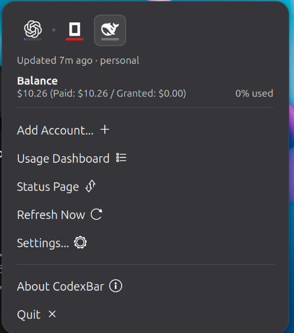
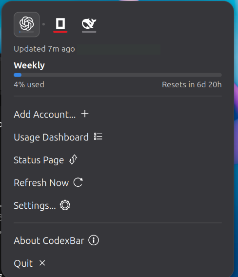

# CodexBar for GNOME

A GNOME Shell panel extension that shows AI provider usage limits, matching the
layout of the macOS CodexBar menu. It reads from the
[`codexbar`](https://github.com/steipete/CodexBar) command line tool, so nothing
is scraped and no browser cookies are handled here.

Targets GNOME Shell 50. Uses the default theme, so it follows your light and dark
settings.

## Screenshots

Each bar carries a tick at the point where usage *should* be by now, so running
hot is visible at a glance. A pace line appears only when a window is actually
over-consumed, which here is all three. The dot in the tab strip marks the
provider the panel bar is tracking.

<table>
  <tr>
    <td align="center" valign="top">
      <br>
      <sub><b>OpenCode Go</b><br>Three rate windows, all running hot</sub>
    </td>
    <td align="center" valign="top">
      <br>
      <sub><b>DeepSeek</b><br>A balance has no percentage, so it shows its value</sub>
    </td>
    <td align="center" valign="top">
      <br>
      <sub><b>Codex</b><br>Weekly window, running under pace</sub>
    </td>
  </tr>
</table>

## Install

```sh
git clone https://github.com/lhw/codexbar-gnome
cd codexbar-gnome
./install.sh
```

Or download `codexbar-gnome@lhw.shell-extension.zip` from the
[releases page](https://github.com/lhw/codexbar-gnome/releases) and install it
with `gnome-extensions install --force <zip>`.

You need the `codexbar` CLI on `PATH` (`brew install steipete/tap/codexbar`, or
a Linux build). On Wayland, log out and back in after installing so the shell
picks up the new extension.

## What it shows

- A tab per provider, as its logo with a load underline, so you can see which one
  needs attention without switching to it
- One section per rate window: the label the CLI reports (Session, Weekly,
  Monthly), a usage bar, the percentage, and a reset countdown
- A pace line when a window is being consumed faster than its elapsed time
  allows
- Balance providers such as DeepSeek, as a value rather than a bar
- A cost summary, today and the last 30 days, for providers `codexbar cost`
  supports: Antigravity, Claude, Codex, Muse Code, and Pi
- Footer actions: Add Account, Usage Dashboard, Status Page, Refresh Now,
  Settings, About CodexBar

Usage Dashboard and Status Page follow whichever provider tab you are on.
Providers are discovered automatically, so there is nothing to configure: enabling
one in codexbar is enough for it to appear here.

## Settings

Two options:

- **Refresh interval**, 1 to 240 minutes. Countdowns between fetches still tick
  every minute, so they stay accurate without polling more often.
- **Show pace**, which controls both the pace lines and the tick on each bar.

## Panel bar

The top-panel indicator is a small bar that fills as the **primary provider**
burns through its worst window, going blue, then amber, then red. Pick the
provider under Settings, or leave it on automatic to track the first one with
usage data.

## Differences from the macOS app

- GNOME's theme draws the popup background, so there is no frosted-glass
  translucency.
- Add Account, Usage Dashboard, and Status Page open web pages. The macOS app
  links into its own UI.
- No Sonnet or Extra usage rows. Those come from Claude-specific fields that the
  current CLI does not expose; they will appear if a provider reports them.

About CodexBar opens a plain dialog with the version, credits and project links,
without dimming the desktop.

## Credits

Fork of [InledGroup/codexbar-gnome](https://github.com/InledGroup/codexbar-gnome),
which is published as [extension 9841](https://extensions.gnome.org/extension/9841/codexbar/)
and linked from the CodexBar README. Rewritten around a single CLI call.

Provider logos come from the
[CodexBar logo set](https://github.com/steipete/CodexBar/tree/main/docs/logos),
converted to GNOME symbolic icons so they follow the theme's foreground.

See `LICENSE.md` for its terms (MIT).

Working on the extension? See [AGENTS.md](AGENTS.md).
