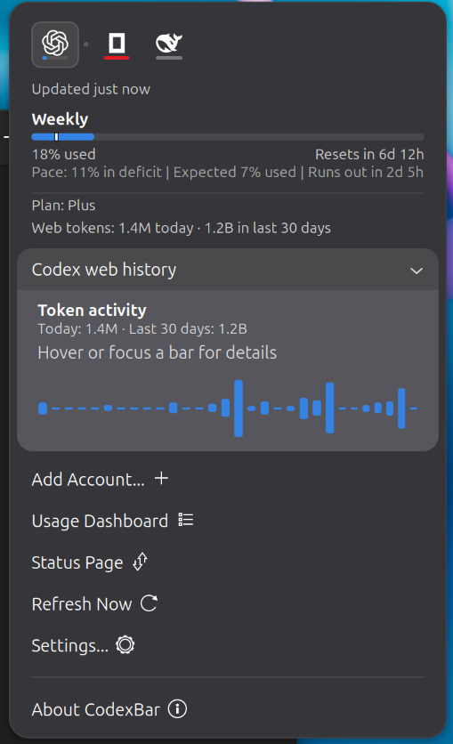
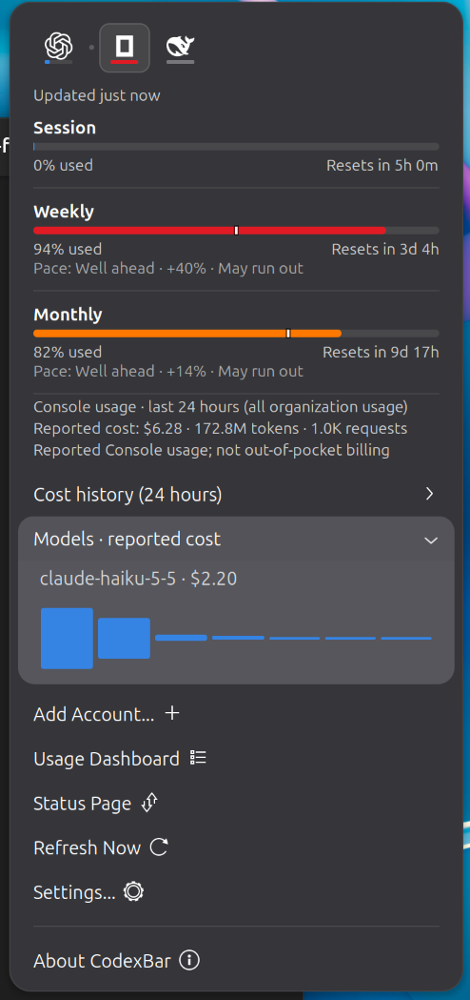
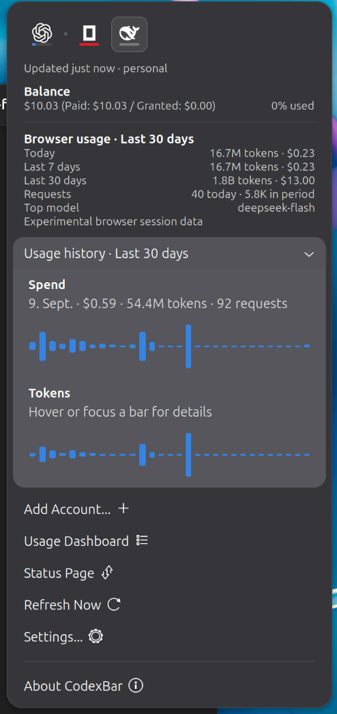

# CodexBar for GNOME

A GNOME Shell 50 panel extension for AI provider usage limits, balances, and
costs, powered by the [`codexbar`](https://github.com/steipete/CodexBar) CLI.
Uses your GNOME theme. An optional browser-session helper adds usage history.

## Screenshots

<table>
  <tr>
    <td align="center" valign="top">
      <br>
      <sub><b>OpenCode Go</b><br>Usage windows</sub>
    </td>
    <td align="center" valign="top">
      <br>
      <sub><b>DeepSeek</b><br>Balance</sub>
    </td>
    <td align="center" valign="top">
      <br>
      <sub><b>Codex</b><br>Weekly usage</sub>
    </td>
  </tr>
</table>

### With the optional browser-session daemon

These charts **require the browser-session daemon and a signed-in browser
session**. They are off by default; see [setup and security](#browser-session-helper).

<table>
  <tr>
    <td align="center" valign="top">
      <br>
      <sub><b>Codex</b><br>30-day web token activity</sub>
    </td>
    <td align="center" valign="top">
      <br>
      <sub><b>OpenCode Go</b><br>Console usage and model costs</sub>
    </td>
    <td align="center" valign="top">
      <br>
      <sub><b>DeepSeek</b><br>Daily spend and token history</sub>
    </td>
  </tr>
</table>

## Install

```sh
git clone https://github.com/lhw/codexbar-gnome
cd codexbar-gnome
./install.sh
```

Or download `codexbar-gnome@lhw.shell-extension.zip` from the
[releases page](https://github.com/lhw/codexbar-gnome/releases) and install it
with `gnome-extensions install --force <zip>`.

You need the `codexbar` CLI on `PATH` (`brew install steipete/tap/codexbar`, or
a Linux build). On Wayland, log out and back in after installing so the shell
picks up the new extension.

## Usage and settings

Enable providers in `codexbar` and their tabs appear automatically. The popup
shows usage windows, reset times, balances, and supported cost estimates, with
links to the selected provider's dashboard and status page.

In **Settings**, choose the refresh interval, toggle pace indicators, and pick
the **primary provider** tracked by the panel bar. The bar changes from blue to
amber to red as usage approaches its limit.

## Browser-session helper

Experimental and off by default. Adds Codex token/credit history, DeepSeek
spend/token history, and OpenCode Console usage. OpenCode costs cover the whole
organization, not just Go, and are not out-of-pocket billing.

Supports Firefox/Waterfox for all three providers; Chrome/Chromium currently
supports DeepSeek only. Normal CLI data remains available if the helper fails.

### Setup and start

Install [uv](https://docs.astral.sh/uv/getting-started/installation/) and sign in
to your providers in the browser. Under **Settings → Optional browser helper**:

1. Click **Find profiles** and confirm the local session scan.
2. Select your browser profile.
3. Enable **Allow browser-session access and show usage**.
4. Click **Set up & start** and confirm downloads and the login service.

Setup downloads an isolated Python environment and dependencies, then starts a
systemd user service at login. Use **Stop** to stop it and disable automatic
startup. Switching browser access off pauses new requests; in-flight requests
may finish. Installing the extension or opening Settings does not start it.

### Security

- The separate daemon reads provider-specific browser credentials and contacts
  unofficial endpoints, which may change. The Shell extension only reads
  sanitized usage caches; credentials and raw responses are not stored in those
  caches or logs.
- Browser databases are read without modifying the originals. Temporary
  snapshots can include other sites' cookies or local storage and may remain
  after a crash.
- The optional **Codex FlareSolverr URL** sends ChatGPT session cookies to that
  server when Cloudflare blocks access. Use only a trusted server, with HTTPS
  unless it is local. Leave it blank to disable this fallback.

### Troubleshooting

Session errors appear in the popup and Settings. If a session expires, sign in
again in the selected browser profile; the helper retries automatically. For
service problems, check:

```sh
journalctl --user -u codexbar-browser-session.service -n 30
```

## Credits

Fork of [InledGroup/codexbar-gnome](https://github.com/InledGroup/codexbar-gnome).
Provider logos from [CodexBar](https://github.com/steipete/CodexBar/tree/main/docs/logos).
MIT licensed; see [LICENSE.md](LICENSE.md). Contributor notes: [AGENTS.md](AGENTS.md).
